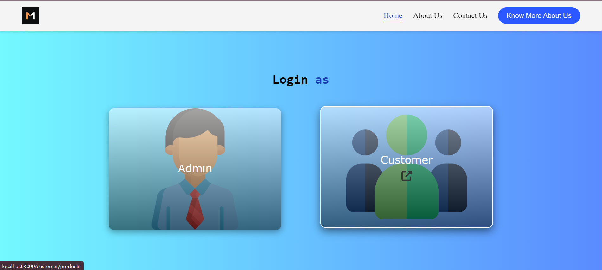
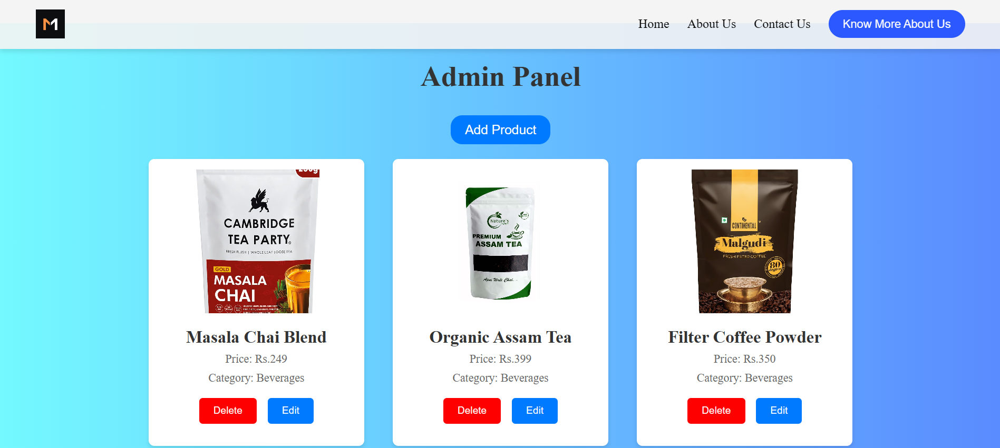
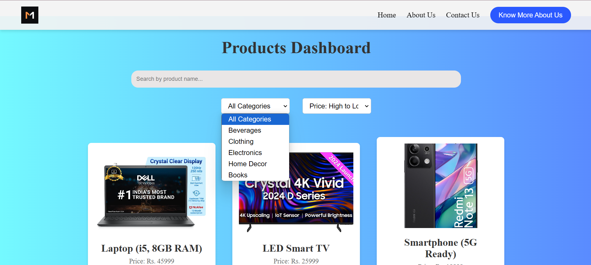

# React Product Catalog

This project is a single-page application (SPA) built with React.js that serves as a product catalog. Users can view, search, filter, sort, and browse detailed information about products. The project uses static JSON data to simulate product information.

## Features

### Core Features
- **Product Listing**: Display a list of products with image, name, price, and a "View Details" button.
- **Product Details**: View detailed information, including a larger image and description of a selected product.
- **Search**: Search products by name in real-time.
- **Category Filter**: Filter products based on their category.
- **Responsive Design**: Fully responsive layout, optimized for desktop, tablet, and mobile devices.

### Enhancements
- **Sorting**: Sort products by price in ascending or descending order.
- **Admin Panel**: Manage products (add, edit, delete) via an admin interface.

---

## Screenshots

### Home Page


### Admin Panel


### Product Details


---

## Installation

### Prerequisites
Make sure you have the following installed on your system:
- Node.js (v16+ recommended)
- npm or yarn

### Steps to Run Locally
1. Clone this repository:
   ```bash
   git clone https://github.com/codeVcreator/react-product-catalog.git
   cd react-product-catalog
   ```

2. Install dependencies:
   ```bash
   npm install
   ```

3. Start the development server:
   ```bash
   npm start
   ```

4. Open the app in your browser at:
   ```
   http://localhost:3000
   ```

---

## Static JSON Sample
Example of a product in `products.json`:
```json
[
  {
    "id": 1,
    "name": "Wireless Headphones",
    "category": "Electronics",
    "price": 99.99,
    "image": "images/headphones.jpg",
    "description": "High-quality wireless headphones with noise cancellation."
  },
  {
    "id": 2,
    "name": "Smart Watch",
    "category": "Electronics",
    "price": 199.99,
    "image": "images/smartwatch.jpg",
    "description": "Stay connected on the go with this stylish smart watch."
  }
]
```

---

## Challenges and Learnings

- **State Management**: Implemented `useState` and `useEffect` to handle component states efficiently.
- **Routing**: Used React Router to create a seamless navigation experience between pages.
- **Responsive Design**: Ensured responsiveness with flexbox and media queries.
- **Reusable Components**: Created modular, reusable components like `ProductItem` and `CategoryFilter`.

---

## Tools and Libraries Used

- **React**: Framework for building the SPA.
- **React Router**: For page navigation.
- **Custom CSS**: For styling the UI.
- **JSON**: Static file used as a mock database.
